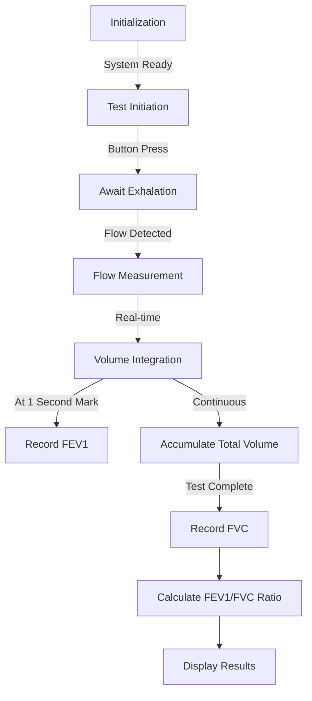

# 🫁 Arduino-based Digital Spirometer

*An affordable and accessible digital spirometer solution using Arduino for respiratory function analysis.*

## 📋 Table of Contents

- [🌟 Overview](#-overview)
- [🎬 Demonstration](#-demonstration)
- [✨ Features](#-features)
- [📊 Clinical Significance](#-clinical-significance)
- [🛠️ Components Required](#-components-required)
- [⚙️ How It Works](#️-how-it-works)
- [🚀 Added Feature: Enhanced Data Logging and Visualization](#-added-feature-enhanced-data-logging-and-visualization)

## 🌟 Overview

This project presents an Arduino-based digital spirometer designed for measuring key lung function parameters. It aims to provide an accessible and cost-effective tool for preliminary respiratory assessment. The system captures and analyzes expiratory airflow to determine vital pulmonary metrics.

## 🎬 Demonstration

  

    
  

https://github.com/user-attachments/assets/9213ecd2-90bc-4221-8fc7-90098d8d4f6e

## ✨ Features

-   **Real-time Flow Rate Measurement**: Captures instantaneous airflow during exhalation.
-   **Forced Vital Capacity (FVC)**: Measures the total volume of air exhaled forcefully.
-   **Forced Expiratory Volume in 1 Second (FEV1)**: Measures the volume of air exhaled in the first second of forced expiration.
-   **FEV1/FVC Ratio Calculation**: Provides a critical clinical indicator for assessing respiratory health and identifying potential obstructive or restrictive patterns.
-   **User-Friendly Interface**: Utilizes a 16x2 LCD for displaying results and test status.
-   **Auditory and Visual Feedback**: Incorporates LEDs and a buzzer for test guidance and completion signals.
-   **Serial Data Output**: Allows for detailed data logging and analysis via the serial monitor.
-   **Portable and Low-Cost**: Built with readily available and affordable components.

## 📊 Clinical Significance

The FEV1/FVC ratio helps in diagnosing:

| Condition | Typical FEV1/FVC Ratio |
|-----------|------------------------|
| Normal | > 70-80% |
| Obstructive (e.g., COPD, asthma) | < 70% |
| Restrictive (e.g., pulmonary fibrosis) | Normal or increased (`≥ 70-80%`, but with reduced FVC and FEV1) |

*Note: These are general guidelines. Clinical diagnosis should always be made by a qualified healthcare professional.*

## 🛠️ Components Required

| Component                                  | Quantity | Notes                                                                 |
|--------------------------------------------|----------|-----------------------------------------------------------------------|
| Arduino Uno/Nano (or compatible)           | 1        | Microcontroller                                                       |
| Flow Sensor (e.g., YF-S201)                | 1        | Pulse output type                                                     |
| 16x2 LCD Display                           | 1        | I2C module recommended for simpler wiring                             |
| Green LED                                  | 1        | For test readiness/completion indication                              |
| Red LED                                    | 1        | For test in progress/error indication                                 |
| Buzzer (5V)                                | 1        | Auditory feedback                                                     |
| Pushbutton (momentary)                     | 1        | Test initiation                                                       |
| Resistors (220Ω)                           | 2+       | Current limiting for LEDs (adjust as needed)                          |
| Resistors (10kΩ)                           | 1 (opt)  | For pushbutton pulldown (if not using internal pull-up)             |
| Breadboard                                 | 1        | Prototyping                                                           |
| Jumper Wires                               | Several  | Connections                                                           |
| Disposable Mouthpiece                      | Several  | Ensure hygienic use                                                   |
| Power Supply for Arduino                   | 1        | USB or external                                                       |

## ⚙️ How It Works

The spirometer works by measuring airflow during forced exhalation through a systematic process:

### 🔄 Spirometer Operation Workflow

| Phase | Description | System Indicators |
|-------|-------------|-------------------|
| 🟢 **Ready** | System initialized and awaiting user input | Green LED on, LCD shows "Ready" |
| 🔴 **Test Active** | Capturing exhalation data | Red LED on, real-time flow displayed |
| 📊 **Processing** | Calculating parameters | Both LEDs blinking |
| 🏁 **Complete** | Test finished, results available | Green LED on, buzzer sounds briefly |

### 📈 Key Measurements & Calculations

- **Flow Rate:** `Flow = K × Pulse Frequency` (where K is the sensor calibration factor)
- **Volume:** `Volume = ∫Flow dt` (practically: sum of flow × time increments)
- **FEV1:** Volume exhaled at exactly 1 second
- **FVC:** Total volume exhaled during the test period
- **FEV1/FVC Ratio:** `(FEV1 / FVC) × 100%`

## 🚀 Added Feature: Enhanced Data Logging and Visualization

### 💻 Data Pipeline Architecture

This project incorporates **real-time data streaming to a connected computer via the serial port**, enabling advanced logging and visualization capabilities. This goes beyond the basic LCD display, offering deeper insights into the respiratory maneuver.

### Impact on Usability:

*   **Clearer Test Performance Feedback**: Users or supervising personnel can observe the flow-volume loop or volume-time curve as it's being generated on a computer screen. This visual feedback is more intuitive than numerical readouts alone, helping to ensure the test is performed correctly (e.g., forceful start, sustained exhalation).
*   **Simplified Data Review**: Instead of manually noting down values from the LCD, all relevant data points (time, instantaneous flow, cumulative volume) can be automatically captured and saved to a file (e.g., CSV) for later review.

### Impact on Efficiency:

*   **Streamlined Data Collection**: Automates the process of recording detailed test parameters, reducing manual effort and potential for transcription errors.
*   **Faster Iteration for Development/Calibration**: During development or calibration, having access to raw sensor data and calculated metrics in real-time on a PC significantly speeds up debugging and fine-tuning the device.
*   **Batch Analysis Potential**: Logged data can be easily imported into spreadsheet software or data analysis tools for batch processing or trend analysis over multiple tests or users.

### Impact on Clinical Value:

*   **Detailed Respiratory Curve Analysis**: Visualizing the flow-volume loop and volume-time curve allows for more nuanced interpretation beyond just FEV1 and FVC. The shape of these curves can provide additional clues about the nature of a respiratory impairment (e.g., "scooping" in obstructive disease).
*   **Improved Test Quality Assessment**: Clinicians or researchers can better assess the quality and acceptability of a spirometry maneuver by examining the full data trace, ensuring ATS/ERS criteria (e.g., good start, no cough, satisfactory exhalation duration) are met.
*   **Longitudinal Monitoring**: By saving test data, it becomes possible to track a patient's lung function over time, which is crucial for managing chronic respiratory diseases and assessing treatment efficacy. While this prototype is not a medical-grade device, this feature demonstrates a pathway towards more robust clinical data management.
*   **Educational Tool**: The ability to visualize respiratory mechanics in real-time makes it an excellent educational tool for students learning about pulmonary function testing.

This added feature significantly elevates the prototype from a simple measurement device to a more comprehensive respiratory analysis tool, enhancing its utility for educational, research, and preliminary assessment purposes.

---

  
Developed as part of the Medical Equipment Course | SBME 2026

  

-   Mostafa Mousa
-   Amaar Yasser
-   Ahmed Adeil
-   Zeyad Wael
-   Hussein Mohamed

